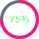
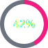
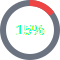

# Donut Chart Gallery

A showcase of creative donut/ring chart designs using the `{{ui:donut}}` component.

---

## Basic Donuts

**Simple 75%:**

**Half Full:**

**Almost There:**

---

## Size Variations

**Tiny (24px):**

**Small (32px):**

**Default (40px):**

**Large (60px):**

**XL (80px):**

---

## Thickness Variations

**Hairline:**

**Thin:**

**Medium:**

**Thick:**

**Chunky:**

---

## With Labels

**Labeled Progress:**

**Large Labeled:**

**Complete:**

---

## Color Palette

**Accent (Pink):**

**Success (Green):**

**Warning (Yellow):**

**Error (Red):**

**Info (Blue):**

**Cobalt:**

---

## Custom Track Colors

**Dark Track:**

**Light Track:**

**Subtle Track:**

**Invisible Track:**

---

## Project Status Dashboard

| Metric | Status |
|--------|--------|
| Tests Passing |  |
| Code Coverage |  |
| Build Health |  |
| Documentation |  |
| Tech Debt |  |

---

## Skill Levels (RPG Style)

| Attribute | Level |
|-----------|-------|
| Strength |  |
| Agility |  |
| Intelligence |  |
| Charisma |  |
| Luck |  |

---

## Battery/Storage Indicators

**Full:**

**Good:**

**Low:**

**Critical:**

---

## Loading States

     

---

## Compact Inline Usage

Storage:  73% used | Memory:  45% | CPU:  92%

---

## Dashboard Row

   

---

## Thin Ring Style (Elegant)

---

## Chunky Pie Style

---

## Team Performance

| Team | Sprint Progress |
|------|-----------------|
| Frontend |  |
| Backend |  |
| DevOps |  |
| QA |  |

---

## Comparison: Donut vs Progress

Same data, different visualization:

| Task | Donut | Bar |
|------|-------|-----|
| API |  |  |
| Tests |  |  |
| Docs |  |  |

---

*Generated with mdfx donut chart component*
