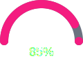
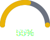
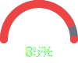

# Donuts & Gauges Gallery

A showcase of creative donut/ring charts and semi-circular gauges using the `{{ui:donut}}` and `{{ui:gauge}}` components.

---

## Donut Charts

### Basic Donuts

**Simple 75%:**

**Half Full:**

**Almost There:**

---

### Size Variations

**Tiny (24px):**

**Small (32px):**

**Default (40px):**

**Large (60px):**

**XL (80px):**

---

### Thickness Variations

**Hairline:**

**Thin:**

**Medium:**

**Thick:**

**Chunky:**

---

### With Labels

**Labeled Progress:**

**Large Labeled:**

**Complete:**

---

### Color Palette

**Accent (Pink):**

**Success (Green):**

**Warning (Yellow):**

**Error (Red):**

**Info (Blue):**

**Cobalt:**

---

### Custom Track Colors

**Dark Track:**

**Light Track:**

**Subtle Track:**

**Invisible Track:**

---

### Project Status Dashboard

| Metric | Status |
|--------|--------|
| Tests Passing |  |
| Code Coverage |  |
| Build Health |  |
| Documentation |  |
| Tech Debt |  |

---

## Gauge Charts

Semi-circular meters perfect for dashboards and speedometer-style displays.

### Basic Gauges

**Simple 75%:**

**Half:**

**Full:**

---

### Size Variations

**Small (60px):**

**Default (80px):**

**Large (120px):**

**XL (160px):**

---

### With Labels

**Labeled Gauge:**

**Large Labeled:**

**Complete with Label:**

---

### Color Variations

**Accent:**

**Success:**

**Warning:**

**Error:**

**Info:**

**Cobalt:**

---

### Speedometer Style

**Speed Low:**

**Speed Medium:**

**Speed High:**

---

### Dashboard Metrics

| Metric | Gauge |
|--------|-------|
| CPU Usage |  |
| Memory |  |
| Disk |  |
| Network |  |

---

### Thin Arc Style

**Elegant Thin:**

**Hairline:**

---

### Thick Arc Style

**Chunky:**

**Bold:**

---

## Comparison: Donut vs Gauge vs Progress

Same data, different visualizations:

| Task | Donut | Gauge | Bar |
|------|-------|-------|-----|
| API |  |  |  |
| Tests |  |  |  |
| Docs |  |  |  |

---

## Neon Gauges

**Neon Green:**

**Neon Pink:**

**Neon Cyan:**

**Neon Orange:**

---

## Loading Gauges

     

---

*Generated with mdfx donut and gauge chart components*
